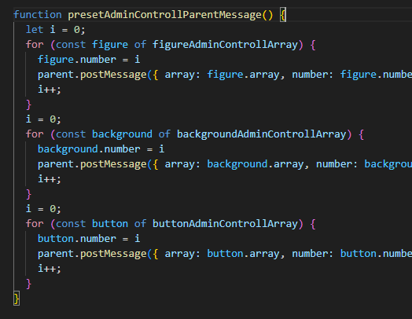
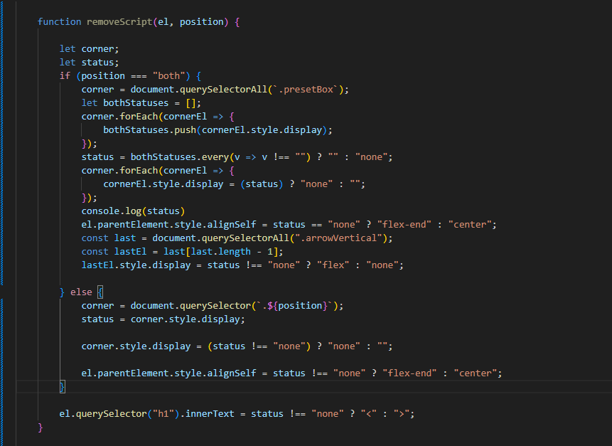
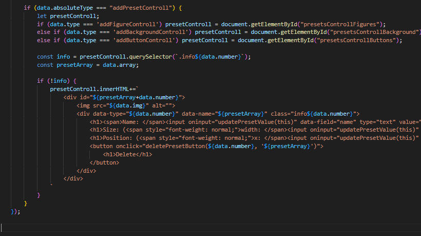
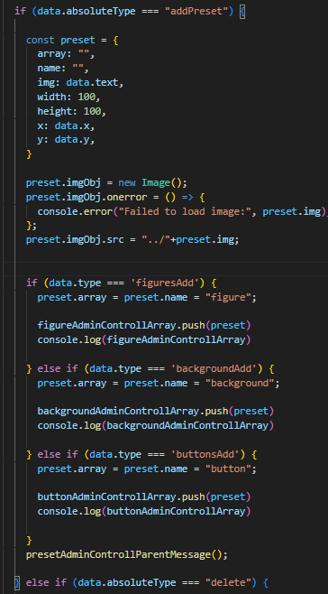
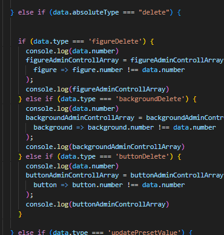
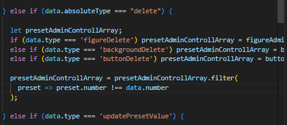
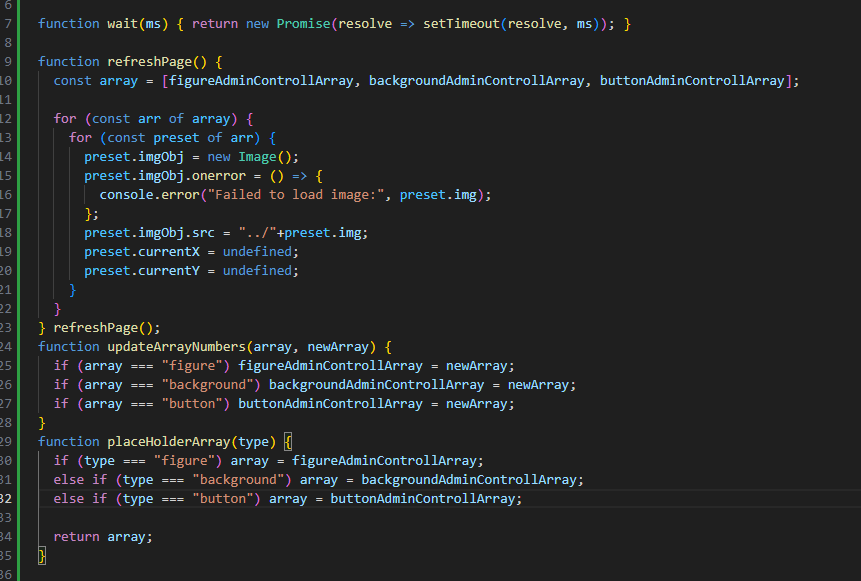
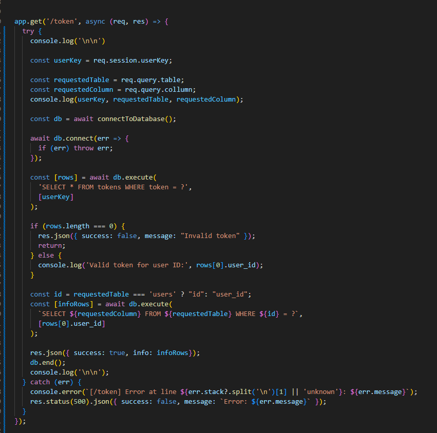
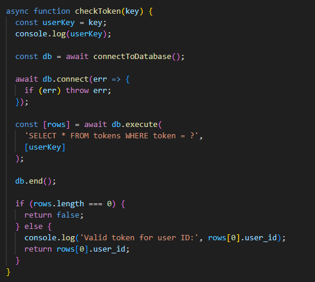
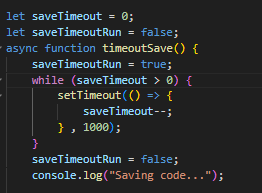

Jeg forminsket flere av de repetetive linjene ved å bruke for loops.

Her gjorde jeg om token checkingen om til en funksjon for slippe å skrive hele om og om igjen.

I removed client.html, as it was cleaner without.

Jeg fikset saving probleme med en if statement.